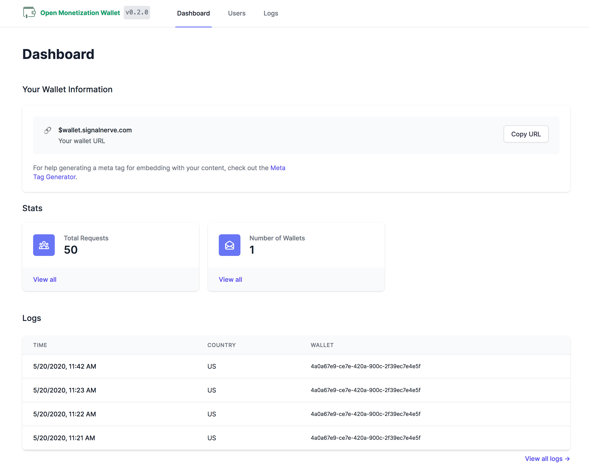

<div align="center">
  <h1>Open Monetization Wallet</h1>
  <p>Tools for managing your vanity Web Monetization wallet</p>
</div>

## Summary

Open Monetization Wallet (OMW) makes it easier to accept payments with the Web Monetization API at scale. Some features:

- Custom wallet URLs: own your own "Payment Pointer", e.g. $wallet.signalnerve.com, instead of $pay.stronghold.co/abcdef123
- Change between wallets/providers with no downtime
- Logs of incoming payment requests
- Revenue sharing between multiple wallets, e.g. for multiple team members
- Infinitely scalable with serverless technology
- Free and open-source



## Prerequisites

- A [Cloudflare Workers](https://workers.dev) unlimited plan to deploy your OMW instance
- If deploying in front of a domain, a configured Cloudflare zone (see the "Origin" section of "Configuration" below)
- [`wrangler`][wrangler] cli tool installed and configured (see the [Quick Start][quick start] in the docs)
- A configured Web Monetization wallet + payment pointer for use in your account, e.g. from [Stronghold](https://stronghold.co/)

## Configuration

### `wrangler.toml`

Copy `wrangler.toml.example` to `wrangler.toml` and begin filling out the file to prepare your OMW instance for deployment.

### KV Namespace

OMW assumes the existence of `DB`, a KV namespace that is used for writing wallet and log information from your application. To create this namespace, use `wrangler`:

``` sh
$ wrangler kv:namespace create DB
```

This will create a KV namespace for your project and give you the appropriate code to copy into `wrangler.toml`. Note that the example `wrangler.toml` includes most of this definition already, so you can simply replace the `$BINDING_ID` value with your unique binding ID to configure the namespace.

### Instance Password

OMW instances are password-protected by default to prevent unauthorized access to your admin panel. To set a randomly generated password, run the included `bin/generate_secret` command. This password will only be shown once, so make sure you write it down somewhere!

```sh
$ bin/generate_secret
# If deploying multiple environments, pass the environment name
# as an argument to generate a new secret for that env
# $ bin/generate_secret [optional_environment]
```

Generally, it's recommended that you _fork_ OMW for your own instance, which will allow you to opt into the automatic GitHub Actions deployment (see "Deploying") and not need to manage your own instance locally. [Better instructions here are in the works!](https://github.com/signalnerve/openmonetizationwallet/issues/6)

To prepare your OMW instance for deployment with GitHub Actions, you should generate two [GitHub secrets][secrets] in your repository's Settings section: `CF_ACCOUNT_ID`, which represents your Cloudflare account ID, and `CF_API_TOKEN`, a unique API token created for deploying Cloudflare Workers projects. For more help finding these values, check out the [Workers Quick Start][quick start].

### Custom domains

If you'd like to deploy your OMW instance to a custom domain, you'll need to configure it inside of the Cloudflare dashboard. For more information on this, see the Workers Quick Start section ["Publish to your Domain"][domain]. Your `wrangler.toml` should include a `zone_id` and `route`, for instance:

```toml
zone_id = "abcdef123"
route = "mycustomwalletdomain.com/*"
```

## Deploying

OMW is set up to allow automatic deployments using [GitHub Actions][gha]. This means that whenever a new Git commit is pushed onto the `master` branch, GitHub Actions will automatically build the project and deploy it. 

You can also deploy manually from your local machine:

``` sh
yarn run gatsby:build
wrangler publish
```

## Development

OMW uses Gatsby and Wrangler for local development. You can begin developing or exploring the application locally by running the following commands:

``` sh
yarn
gatsby develop # Local UI development
wrangler dev   # Test serverless/edge functionality
```

Note that many of the edge/serverless operations, such as loading KV data locally, aren't supported inside of the `gatsby develop` workflow. This is something I'd like to fix in the future, and I've opened a ticket for tracking it: https://github.com/signalnerve/openmonetizationwallet/issues/7

## License

OMW is licensed under the [MIT license](https://github.com/signalnerve/openmonetizationwallet/blob/master/LICENSE).

[quick start]: https://developers.cloudflare.com/workers/quickstart#configure
[wrangler]: https://github.com/cloudflare/wrangler
[gha]: https://github.com/features/actions
[secrets]: https://help.github.com/en/actions/configuring-and-managing-workflows/creating-and-storing-encrypted-secrets
[domain]: https://developers.cloudflare.com/workers/quickstart#publish-to-your-domain
